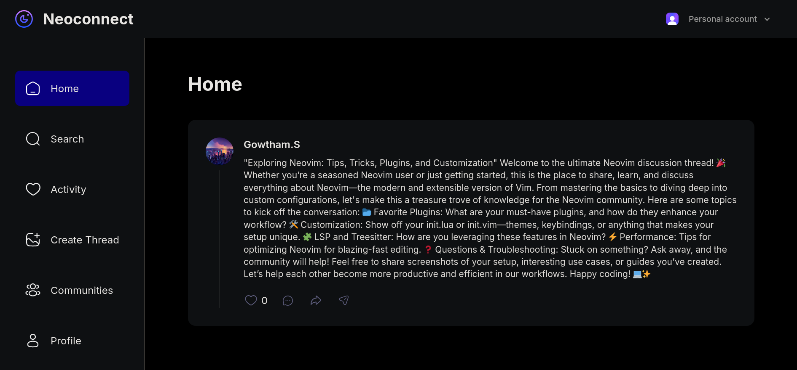
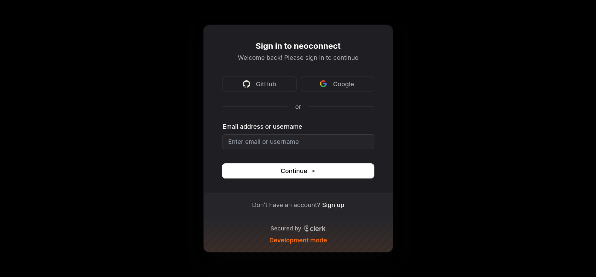
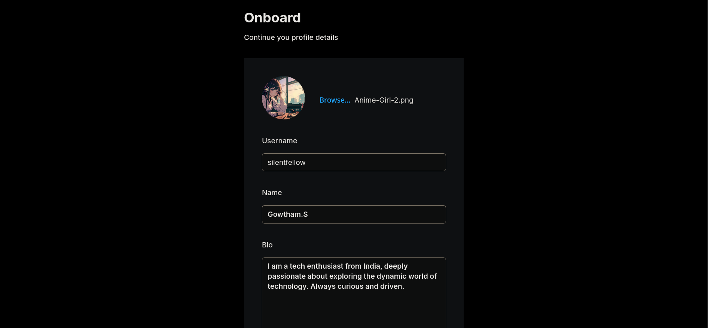
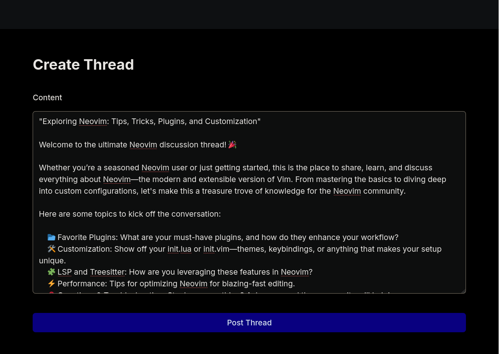
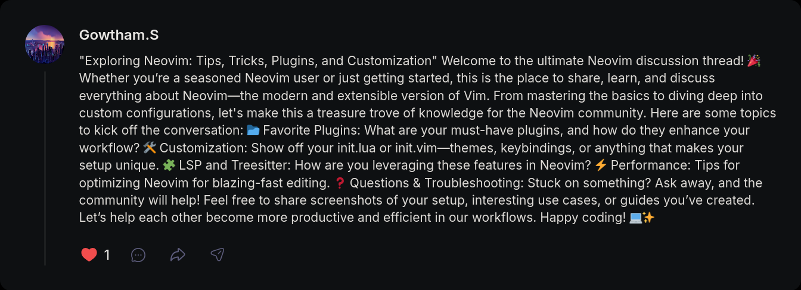
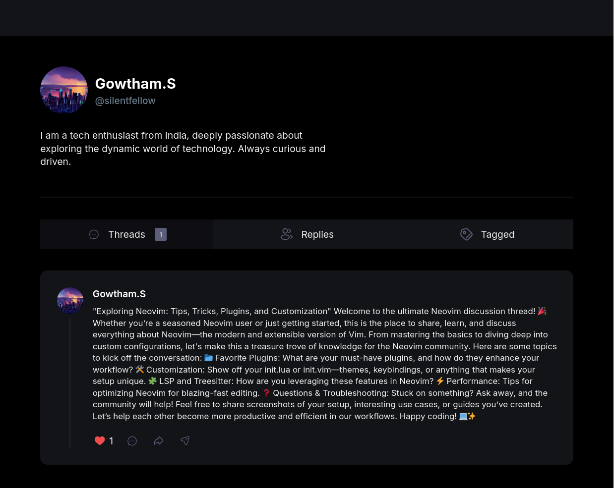
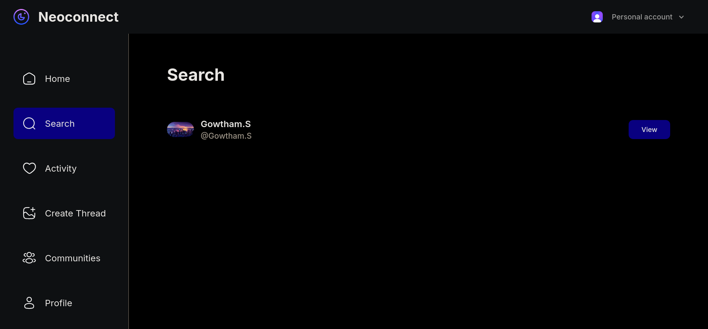

# NeoConnect

NeoConnect is a social discussion forum built with Next.js, TypeScript, TailwindCSS, Clerk for authentication, and UploadThing for data storage.

## Features

- User authentication with Clerk
- Create and manage threads
- Like and comment on threads
- User profiles
- Search functionality
- Responsive design with TailwindCSS

## Screenshots

### Home


### Login


### Onboarding


### Create Thread


### Liked Thread


### Profile


### Search


## Getting Started

### Prerequisites

- Node.js
- npm or yarn

### Installation

1. Clone the repository:
    ```sh
    git clone https://github.com/yourusername/neoconnect.git
    cd neoconnect
    ```

2. Install dependencies:
    ```sh
    npm install
    # or
    yarn install
    ```

3. Set up environment variables:
    Create a `.env.local` file in the root of your project and add the necessary environment variables for Clerk and UploadThing.

4. Run the development server:
    ```sh
    npm run dev
    # or
    yarn dev
    ```

5. Open [http://localhost:3000](http://localhost:3000) with your browser to see the result.

## Contributing

Contributions are welcome! Please open an issue or submit a pull request for any changes.

## License

This project is licensed under the MIT License.
```

Feel free to customize the content as needed.
